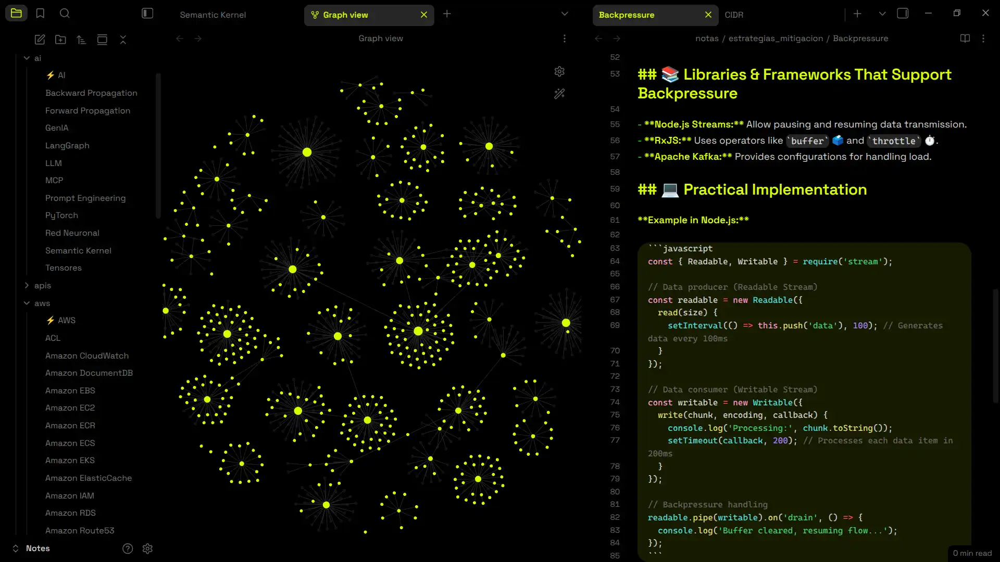

# Tyrone Neon Theme for Obsidian

A modern Obsidian theme with vibrant neon aesthetics, featuring a clean interface and customizable accent colors to match your style

## ✨ Features

### 🎨 **Customizable Accent Colors**

- **User-controlled accent color selection** - Choose any accent color from Obsidian's appearance settings
- **Dynamic color adaptation** - The theme automatically adapts all UI elements to your chosen accent color
- **Consistent color palette** - Your accent color is applied throughout the entire interface for a cohesive look

### 🌓 **Dual Theme Support**

- **Dark Mode**: Pure black backgrounds with vibrant neon accents
- **Light Mode**: Clean white interface with refined color adjustments
- **Seamless switching** between light and dark modes

### 🎯 **Modern Design Elements**

- **Rounded corners** throughout the interface for a contemporary feel
- **Clean typography** using Inter font family for optimal readability
- **Minimalist borders** - Removed unnecessary borders for a cleaner look
- **Smooth hover effects** with consistent interactive feedback

### 📝 **Enhanced Editor Experience**

- **Syntax highlighting** with theme-appropriate colors
- **Code block styling** with accent-colored borders
- **Improved readability** with optimized line spacing and font sizes
- **Visual hierarchy** with properly weighted headers and text

## 🚀 Installation

### Method 1: Community Themes (Recommended)

1. Open Obsidian Settings
2. Navigate to **Appearance**
3. Click **Browse** under Community Themes
4. Search for "Tyrone Neon"
5. Click **Install and Use**

### Method 2: Manual Installation

1. Download the `theme.css` file from this repository
2. Copy it to your vault's `.obsidian/themes/` folder
3. Rename it to `Tyrone Neon.css`
4. Go to **Settings → Appearance → Themes**
5. Select "Tyrone Neon" from the dropdown

## ⚙️ Customization

### Accent Color

The theme's greatest strength is its **user-customizable accent color**:

1. Go to **Settings → Appearance**
2. Under **Accent color**, choose any color you like
3. The theme will automatically apply your color to:
   - Headers and titles
   - Links and internal links
   - Active tabs and navigation elements
   - Code block borders
   - Interactive hover states
   - Graph view highlights

### Recommended Colors

While any color works, these combinations look particularly stunning:

- **Yellow** (`#daff01`) - Bright yellow
- **Hot Pink** (`#ff0051`) - Vibrant magenta
- **Neon Green** (`#00ff04`) - Electric lime
- **Purple** (`#9d00ff`) - Deep violet
- **Electric Blue** (`#00e5ff`) - Classic neon blue

## 🔧 Compatibility

- **Obsidian Version**: 1.0.0+
- **Plugin Support**: Compatible with most community plugins
- **Mobile Support**: Optimized for both desktop and mobile experiences
- **Graph View**: Full support with themed colors
- **Canvas**: Compatible with Obsidian Canvas feature

## 📄 License

This theme is released under the [MIT License](LICENSE).

**⭐ If you enjoy this theme, please consider giving it a star!**

---

**Made with ❤️ by [Tyrone José](https://github.com/tyronejosee)**
